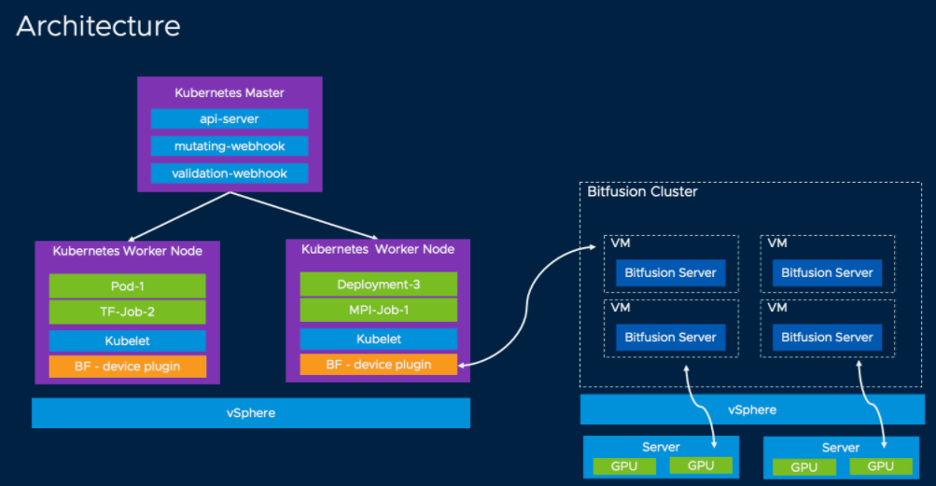
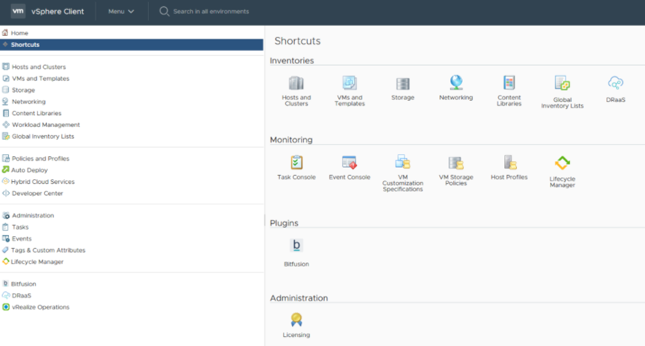
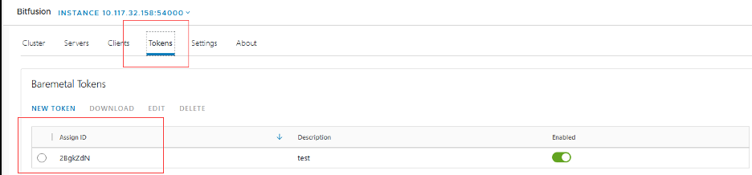
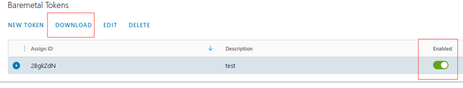
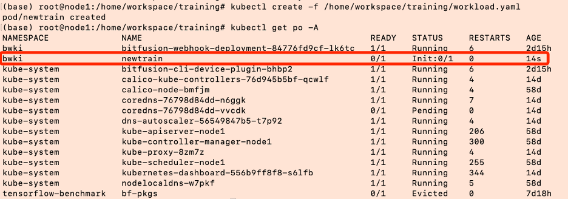

# Build the AI application with the Bitfusion on Kubernetes
## AI workload and GPU accelerator 
Artificial intelligence (AI) is the technology concerned with building machines capable of performing tasks that typically require human intelligence. AI is an interdisciplinary science with multiple approaches, but advancements in machine learning and deep learning are creating a paradigm shift in virtually every sector of the tech industry. 
As with deep learning, many issues can arise with naively trained DNNs. The common issue is computation time.

DNNs must consider many training parameters, such as the number of layers, number of units per layer, the learning rate, and initial weights.  Various tricks, such as batching (computing the gradient on several training examples at once rather than individual examples) speed up computation. 

Since the 2010s, advances in both machine learning algorithms and computer hardware have led to more efficient methods for training deep neural networks that contain many layers of non-linear hidden units and a very large output layer. Large processing capabilities of many-core architectures such as GPUs have produced significant speedups in training, because of the suitability of such processing architectures for the matrix and vector computations.
By 2019, graphic processing units (GPUs), often with AI-specific enhancements, had displaced CPUs as the dominant method of training large-scale commercial cloud AI.

Originally developed inside Google, Kubernetes has been an open-source project since June 2014 and managed by the Cloud Native Computing Foundation (CNCF) since Google and Linux partnered to found the CNCF in July 2015. Kubernetes is an orchestration system that automates the processes involved in running thousands of containers in production. It eliminates the infrastructure complexity associated with deploying, scaling, and managing containerized applications. Kubernetes has become the de facto platform to deploy and manage machine learning workloads.

## Current solutions of GPU management
Currently there are 3 common ways below to use GPUs:
- Consume GPU resource without sharing
- Sharing GPU resource to different application workloads without isolation
- Sharing GPU resource with GPU virtualization

But current solutions of GPU management may have some shortcomings:
- Underutilized GPU compute cycle
- Limited and preset granularity
- Resource bound to local machine
- Hard for application scheduling

Bitfusion helps address the problems by providing a pool of shared, network-accessible GPU resources. Bitfusion makes GPUs a first class citizen that can be abstracted, partitioned, automated and shared like compute resource.

However, out of the box Kubernetes does not offer a way to consume Bitfusion's network-attached GPUs. This limitation becomes a key challenge to enable jobs on Kubernetes to use Bitfusion’s GPU. Kubernetes needs a friendly way to consume Bitfusion GPU resources for the following reasons:
- Resource management
- GPU pool management

## Bitfusion on Kubernetes

To address these problems, the project “Bitfusion on Kubernetes” allows Kubernetes to work with Bitfusion. “Bitfusion on Kubernetes”  supports transparent GPU allocation to developers.
Bitfusion GPU resources is consumed via Kubernetes’ native approach. At the same time, GPU quota can be enforced for Kubernetes namespace.
“Bitfusion on Kubernetes” contains 3 components:
- A device plugin of Kubernetes for Bitfusion GPU resources. 
- A validating webhook 
- A mutating webhook


The admission control process proceeds in two phases. In the first phase, mutating admission controllers are run. In the second phase, validating admission controllers are run. 
If any of the controllers in either phase reject the request, the entire request is rejected immediately and an error is returned to the end-user.

This admission controller calls any validating webhooks which match the request. Matching webhooks are called in parallel; if any of them rejects the request, the request fails. This admission controller only runs in the validation phase; the webhooks it calls may not mutate the object, as opposed to the webhooks called by the MutatingAdmissionWebhook admission controller.  The validating webhook of Bitfusion device plugin is to validate if there is Bitfusion resource allocatable in the Kubernete cluster. If not, it will give a error message when a resource request is submitted.

This admission controller calls any mutating webhooks which match the request. Matching webhooks are called in serial; each one may modify the object if it desires.
	
Device plugin and webhook (validating webhook and mutating webhook) are built into two separated docker images.
The device plugin of Kubernetes runs as a DaemonSet on each worker node where kubelet is running. The bitfusion-webhook runs as a Deployment on the Kubernetes master node.


Potential users:
1.	Customers are those who have AI/ML workload and would like to run on vSphere/Kubernetes
2.	Vendors who are partnering with VMware to deliver AI Appliance solution.
3.	Other Kubernetes solutions that support AI/ML workload and want to leverage Bitfusion GPU

## How to build the AI application with the Bitfusion on Kubernetes

Computer vision is an interdisciplinary field that deals with how computers can be made to gain high-level understanding from digital images or videos. Computer vision technology is one of the most promising areas of research within artificial intelligence and computer science and offers tremendous advantages for businesses in the modern era.
At its heart, the field of computer vision focuses on designing computer systems that possess the ability to capture, understand, and interpret important visual information contained with image and video data. Computer vision systems then translate this data, using contextual knowledge provided by human beings, into insights used to drive decision making. Turning raw image data into higher-level concepts so that humans or computers can interpret and act upon them is the principal goal of computer vision technology.
In this section, it will explain how to perform classification using Bitfusion on Kubernetes with TensorFlow library in Python.

###  1. Setup the environment
**(1)	Bitfusion**
Before building the model, you need to setup the related environment for the DNN training.  Make sure you have installed the VMware vSphere Bitfusion and NVIDIA driver. Bitfusion runs as a client-server architecture. It runs a GPU service on VMware appliances (VMs with prepackaged software and services). These GPU servers require access to local GPUs (usually through VMware vSphere DirectPath I/O). The Host must run vSphere 7. Bitfusion client software runs on the virtual machines where the applications run. Clients may use vSphere 7 or 6.7.
The Bitfusion servers will register a Bitfusion plug-in on VMware vCenter. The plug-in provides monitoring and management of the clients and servers. For more details about the installation of vSphere Bitfusion, please refer to: <https://docs.vmware.com/en/VMware-vSphere-Bitfusion/2.0/vmware-vsphere-bitfusion-20-installation-guide.pdf>

**(2)	Kubernetes**
In order to enable Bitfusion on Kubernetes, it is necessary to deploy a Kubernetes cluster or use an existed Kubernetes environment to run the workload. For example, you can provision Tanzu Kubernetes clusters by invoking the Tanzu Kubernetes Grid Service declarative API. 
Get more details of Tanzu Kubernetes Grid Service, please refer to: <https://docs.vmware.com/en/VMware-vSphere/7.0/vmware-vsphere-with-tanzu/GUID-3040E41B-8A54-4D23-8796-A123E7CAE3BA.html>


**(3)	Bitfusion device plugin**
Then you can begin to install the Bitfusion device plugin. The Bitfusion device plugin allows Kubernetes to work with Bitfusion.
In order to enable Bitfusion, users must generate a Baremetal Token for authorization and download the related tar file to the installation machine.

Follow these steps to get the token from the vCenter:
Step 1. Login to vCenter
Step 2. Click on Bitfusion in Plugins section



Step 3. Select the Tokens tab and then select the proper token to download


Step 4. Click DOWNLOAD button, make sure the token is Enabled.


If no tokens are available in the list, click on NEW TOKEN to create a Token.
For more details, please refer to:
<https://docs.vmware.com/en/VMware-vSphere-Bitfusion/2.5/Install-Guide/GUID-361A9C59-BB22-4BF0-9B05-8E80DE70BE5B.html>

Then create a Kubernetes secret using the Baremetal Token. Upload the Baremetal Tokens files to the installation machine. Use the following command to unzip the files:
```
$ mkdir tokens    
$ tar -xvf ./2BgkZdN.tar -C tokens
```

Now we have three files in the tokens/ directory: ca.crt, client.yaml and services.conf :

```
tokens  
├── ca.crt  
├── client.yaml  
└── servers.conf  
```

Then use the following command to create a secret in Kubernetes in the namespace of kube-system:
```
$ kubectl create secret generic bitfusion-secret --from-file=tokens -n kube-system
```

For more details about kubectl:  <htts://kubernetes.io/docs/reference/kubectl/overview/>
After that, you can deploy the Bitfusion device plugin with pre-built images. Use the following command to clone the source code:

```
$ git clone https://github.com/vmware/bitfusion-with-kubernetes-integration.git
```

Use the following commands to deploy the Bitfusion device plugin and other related components, make sure the Kubernetes cluster has Internet connection.

```
$ cd bitfusion-with-kubernetes-integration-main/bitfusion_device_plugin
$ make deploy
```
###  2. Investigate on the application requirements and training data

This guide uses the ImageNet dataset (ILSVRC2012). The ImageNet dataset contains 14,197,122 annotated images according to the WordNet hierarchy. The training data, the subset of ImageNet containing the 1000 categories and 1.2 million images.

The average resolution of an ImageNet image is 469x387. They are usually cropped to 256x256 or 224x224 in your image preprocessing step.

The goal of the application is to train a neural network to classify different object in images.  In this blog, it will use 4 kinds of sample data to train the model. 

|  folder name | animals|  quantity of samples | label|
| -----| -----  | ----  |----  |
|n01440764     | tench | 1300| 1 | 
|n01514668     | cock  | 1300|2 | 
|n02119022     | red fox | 1300|3 |
|n02489166     | proboscis monkey | 1300|0 |

Get the ILSVRC2012 dataset through this link:  <http://www.image-net.org/download>

### 3. Build your AI model to meet the demand.
A convolutional neural network (CNN) is built to classify the 4 categories of image. We take the VGG19 model for example. 

VGG19 is a variant of VGG model which in short consists of 19 layers (16 convolution layers, 3 Fully connected layer, 5 MaxPool layers and 1 SoftMax layer). There are other variants of VGG like VGG11, VGG16 and others. VGG19 has 19.6 billion FLOPs.

So in simple language VGG is a deep CNN used to classify images. The layers in VGG19 model are as follows:
>    Conv3x3 (64)<br/>
>    Conv3x3 (64)<br>
>    MaxPool
>    Conv3x3 (128)
>    Conv3x3 (128)
>    MaxPool
>    Conv3x3 (256)
>    Conv3x3 (256)
>    Conv3x3 (256)
>    Conv3x3 (256)
>    MaxPool
>    Conv3x3 (512)
>    Conv3x3 (512)
>    Conv3x3 (512)
>    Conv3x3 (512)
>    MaxPool
>    Conv3x3 (512)
>    Conv3x3 (512)
>    Conv3x3 (512)
>    Conv3x3 (512)
>    MaxPool
>    Fully Connected (4096)
>    Fully Connected (4096)
>    Fully Connected (1000)
>    SoftMax


A fixed size of (224 * 224) RGB image was given as input to this network which means that the matrix was of shape (224,224,3). Used kernels of (3 * 3) size with a stride size of 1 pixel, this enabled them to cover the whole notion of the image. Spatial padding was used to preserve the spatial resolution of the image. Max pooling was performed over a 2 * 2 pixel windows with sride 2. This was followed by Rectified linear unit (ReLU) to introduce non-linearity to make the model classify better and to improve computational time as the previous models used tanh or sigmoid functions this proved much better than those. Implemented three fully connected layers from which first two were of size 4096 and after that a layer with 1000 channels for 1000-way ILSVRC classification and the final layer is a softmax function. 

The speed of training process is greatly improved by using the GPU accelerator. Here is the source code of training script using Tensorflow:
train.py

```
import os
import cv2
import numpy as np
import tensorflow as tf
from tensorflow.keras import layers, models
from tensorflow.keras.optimizers import Adam
from tensorflow.keras.utils import to_categorical
from tensorflow.keras.applications import VGG19

tf.compat.v1.disable_eager_execution()

# ID of GPU to be used for training
os.environ['CUDA_VISIBLE_DEVICES'] = '0'

# Directory of training samples
samples_dir = '/home/workspace/training/data/'

# HWC of the image to train
image_width = 224
image_height = 224
image_channels = 3

# Number of epochs for training
epochs = 100

# Batch size for training
batch_size = 64

# Percentage of samples to be used for training set
training_percent = 70

# Percentage of samples to be used for validation set
validation_percent = 15


def preprocess_images(data_to_process, labels_to_process):
    # Normalize the image to the range of (0, 0.1)
    data = data_to_process.astype("float32") / 255

    # Transform the label data to one-hot encoding. 4 categories for training.
    label = to_categorical(labels_to_process, 4)
    return data, label


def read_all_samples(sample_dir):
    # Number of total images
    num = 0

    # Category of the sample image
    number_of_class = 0

    # List to store the label of image
    label_list = []

    # List to store all the images
    img_list = []
    for directory in os.listdir(sample_dir):
        tmp_dir = os.path.join(sample_dir, directory)
        for image in os.listdir(tmp_dir):
            num += 1
            tmp_img_filepath = os.path.join(tmp_dir, image)

            # Read the image as the type of numpy.ndarray
            im = cv2.imread(tmp_img_filepath)

            # Corp the image
            im = cv2.resize(im, (image_width, image_height))
            img_list.append(im)

            # Add the category to List
            label_list.append(number_of_class)
            # print("Picture " + str(num) + " Load " + tmp_img_filepath + " successfully")
        number_of_class += 1

    print("All the " + str(num) + " pictures belong to " + str(number_of_class) + " categories")
    return np.array(img_list), np.array(label_list)


def split_data_set(data_to_process, label_to_process, training_set_percentage, validation_set_percentage):
    s = np.arange(data_to_process.shape[0])
    np.random.shuffle(s)
    # Images after shuffled
    data_to_process = data_to_process[s]

    # Labels after shuffled
    label_to_process = label_to_process[s]
    all_len = data_to_process.shape[0]

    # Number of samples for training set
    train_len = int(all_len * training_set_percentage / 100)

    # Number of samples for validation set
    validation_len = int(all_len * validation_set_percentage / 100)

    temp_len = train_len + validation_len

    # Training set and labels
    train_data, train_label = data_to_process[0:train_len, :, :, :], label_to_process[0:train_len, :]

    # Validation set and labels
    validation_data = data_to_process[train_len:temp_len, :, :, :]
    validation_label = label_to_process[train_len:temp_len, :]

    # Test set and labels
    test_data, test_label = all_data[temp_len:, :, :, :], all_label[temp_len:, :]

    return train_data, train_label, validation_data, validation_label, test_data, test_label


def train_classifier(train_data, train_label, valadation_data, valadation_label, lr=1e-4):
    conv_base = VGG19(weights='imagenet',  # Set weights = "imagenet" to use pre-trained parameters
                      include_top=False,
                      input_shape=(image_height, image_width, 3))
    model = models.Sequential()
    model.add(conv_base)
    model.add(layers.Flatten())
    model.add(layers.Dropout(0.5))
    model.add(layers.Dense(30, activation='relu'))
    model.add(layers.Dense(4, activation='softmax'))
    conv_base.trainable = True
    model.compile(
        loss='categorical_crossentropy',  # Loss fuction
        optimizer=Adam(lr=lr),  # Adam optimizer
        metrics=['accuracy'])

    # Prints a string summary of the network
    model.summary()

    early_stopping = tf.keras.callbacks.EarlyStopping(monitor="val_loss", min_delta=0, patience=5, verbose=0,
                                                      baseline=None, restore_best_weights=True)
    history = model.fit(
        train_data, train_label,
        batch_size=batch_size,  # iteration = epochs / batch_size,
        epochs=epochs,
        validation_data=(valadation_data, valadation_label),  # Data set for validation
        callbacks=[early_stopping])
    return model, history


all_data, all_label = read_all_samples(samples_dir)

# Sample data after being pre-processed
all_data, all_label = preprocess_images(all_data, all_label)

training_set, training_label, validation_set, validation_label, test_data, test_label = \
    split_data_set(all_data, all_label, training_percent, validation_percent)

# Train the model
train_classifier(training_set, training_label, validation_set, validation_label )

```

### 4.	Training the model with Bitfusion on Kubernetes.
**(1) Setup the training data**
Login to a Kubernetes worker node which the training workload will be arranged to. For example, node1 is a Kubernetes worker node. Log in to node1 and setup the dataset and script for training. Copy the ImageNet dataset (ILSVRC2012_img_train.tar) to node1 (/data) and extract the tar file.

```
$ scp ILSVRC2012_img_train.tar node1:/data
$ ssh node1
$ cd /data
$ mkdir /data/imageNet
$ tar xvf /data/ILSVRC2012_img_train.tar -C /data/imageNet
```

After running the command above, 1000 tar files are created in ‘/data/imageNet’ directory. Images of the same file are the same category of objects. In this example, 4 categories are chosen for training (n01440764.tar,  n01514668.tar,  n02119022.tar,  n02489166.tar).
```
/data/imageNet  
├── n01440764.tar  
├── n01514668.tar
├── n02119022.tar
└── n02489166.tar
```

Use commands below to create 4 folders in the workspace which represent 4 categories. The training samples are extracted to each folder separately. 
```
$ mkdir -p /home/workspace/training/data/0
$ mkdir -p /home/workspace/training/data/1
$ mkdir -p /home/workspace/training/data/2
$ mkdir -p /home/workspace/training/data/3
$ tar xvf /data/imageNet/n02489166.tar -C /home/workspace/training/data/0
$ tar xvf /data/imageNet/n01440764.tar -C /home/workspace/training/data/1
$ tar xvf /data/imageNet/n01514668.tar -C /home/workspace/training/data/2
$ tar xvf /data/imageNet/n02119022.tar -C /home/workspace/training/data/3
```

After that, each of the 4 folders contains 1300 JPEG images.

**(2) Configure the yaml file of the training workload**
After completing the installation and setup, users can write a YAML file of Kubernetes to consume the Bitfusion resources. There are three parameters related to Bitfusion resource in a YAML file:
- auto-management/bitfusion: yes / no
Use this annotation to describe whether Bitfusion device plugin is enabled for this workload.
- bitfusion.io/gpu-num:
Number of GPU the workload requires from the Bitfusion cluster
- bitfusion.io/gpu-percent:
Percentage of the memory of each GPU

Use the yaml file below to describe the training workload for Kubernetes. The variable “train” is the directory where the training data and script resides on the host and it will be mounted into the pod.


Below is the output of “tree /home/workspace/training” command:  
```
training
├── data
│   ├── 0
│   │   ├── n02489166_10029.JPEG
│   │   ├── n02489166_10031.JPEG
│   │    ……
│   ├── 1
│   │   ├── n01440764_10026.JPEG
│   │   ├── n01440764_10027.JPEG
│   │    ……
│   ├── 2
│   │   ├── n01514668_10004.JPEG
│   │   ├── n01514668_10014.JPEG
│   │    ……
│   ├── 3
│   │   ├── n02119022_10008.JPEG
│   │   ├── n02119022_10018.JPEG
│   │    ……
├── train.py
└── workload.yaml
```

The workload.yaml file:
```
apiVersion: v1
kind: Pod
metadata:
  annotations:
    auto-management/bitfusion: "all"
    bitfusion-client/os: "ubuntu18"
    bitfusion-client/version: "400"
  name: newtrain
  namespace: bwki
spec:
  containers:
    - image: bitfusiondeviceplugin/tensorflow:20.01-tf2-py3
      imagePullPolicy: IfNotPresent
      name: newtrain
      command: ["python /home/workspace/training/train.py"]
      resources:
        limits:
          bitfusion.io/gpu-amount: 1
          bitfusion.io/gpu-percent: 100
      volumeMounts:
        - name: code
          mountPath: /home/workspace/training/
  volumes:
    - name: code
      hostPath:
        path: /home/workspace/training/
```

bitfusiondeviceplugin/tensorflow:20.01-tf2-py3 is an image based NGC docker container image(nvcr.io/nvidia/tensorflow:20.01-tf2-py3).  

Here is the information of the container:
>Ubuntu 18.04.3 LTS
>Python version 3.6.9
>Tensorflow version GPU 2.0.0  
>Cuda version 10.2.89
>opencv version 4.5.1

CV2 module is installed to the image. CV2 module is used to preprocess the images before training. For other images, login into the container and use commands below to install the cv2 module.

```
$ pip install opencv-python
$ apt-get update
$ apt-get install -y libgl1-mesa-dev
```

The training workload can use the images which are cropped to train.

### **(3) Submit and monitoring the training job**
Use the kubectl command to submit the training job to Kubernetes cluster. 
```
$ kubectl create -f /home/workspace/training/workload.yaml
```



Then you can get the log of training by the command below:
```
$ kubectl logs -f -n bwki  newtrain
```

The log output is:
```
[INFO] 2021-09-03T00:39:22Z Query server 10.117.32.177:56001 to claim client id: 83a890bb-422d-419f-a5d8-61db0d149cf1
[WARN] 2021-09-03T00:39:23Z Unable to backup old client config file: rename /root/.bitfusion/client.yaml /root/.bitfusion/client.yaml.20210903T003923: device or resource busy
[INFO] 2021-09-03T00:39:23Z Query server 10.117.32.177:56001 gpu availability
[INFO] 2021-09-03T00:39:23Z Choosing GPUs from server list [10.117.32.177:56001]
[INFO] 2021-09-03T00:39:23Z Requesting GPUs [0] with 16160 MiB of memory from server 0, with version 4.0.0-639f4163...
Requested resources:
Server List: 10.117.32.177:56001
Client idle timeout: 0 min
[INFO] 2021-09-03T00:39:23Z Locked 1 GPUs with partial memory 1, configuration saved to '/tmp/bitfusion940406361'
[INFO] 2021-09-03T00:39:23Z Running client command 'python /home/workspace/training/train.py' on 1 GPUs, with the following servers:
[INFO] 2021-09-03T00:39:23Z 10.117.32.177 55001 02491a45-fb7d-4894-833f-bf71ea724e44 56001 4.0.0-639f4163

[INFO] 2021-09-03T00:39:23Z Command started, launching telemetry process: 83a890bb-422d-419f-a5d8-61db0d149cf1 | 10.117.32.177:56001
2021-09-03 00:39:24.627043: I tensorflow/stream_executor/platform/default/dso_loader.cc:44] Successfully opened dynamic library libcudart.so.10.2
WARNING:tensorflow:From /usr/local/lib/python3.6/dist-packages/tensorflow_core/python/ops/resource_variable_ops.py:1630: calling BaseResourceVariable.__init__ (from tensorflow.python.ops.resource_variable_ops) with constraint is deprecated and will be removed in a future version.
Instructions for updating:
If using Keras pass *_constraint arguments to layers.
All the 5200 pictures belong to 4 categories
Downloading data from https://github.com/fchollet/deep-learning-models/releases/download/v0.1/vgg19_weights_tf_dim_ordering_tf_kernels_notop.h5
80142336/80134624 [==============================] - 6s 0us/step
2021-09-03 00:40:08.687324: I tensorflow/stream_executor/platform/default/dso_loader.cc:44] Successfully opened dynamic library libcuda.so.1
2021-09-03 00:40:09.428650: I tensorflow/stream_executor/cuda/cuda_gpu_executor.cc:1006] successful NUMA node read from SysFS had negative value (-1), but there must be at least one NUMA node, so returning NUMA node zero
2021-09-03 00:40:09.430776: I tensorflow/core/common_runtime/gpu/gpu_device.cc:1618] Found device 0 with properties: 
name: Tesla V100-PCIE-16GB major: 7 minor: 0 memoryClockRate(GHz): 1.38
pciBusID: 0000:00:00.0
2021-09-03 00:40:09.431164: I tensorflow/stream_executor/platform/default/dso_loader.cc:44] Successfully opened dynamic library libcudart.so.10.2
2021-09-03 00:40:09.436589: I tensorflow/stream_executor/platform/default/dso_loader.cc:44] Successfully opened dynamic library libcublas.so.10
2021-09-03 00:40:09.440560: I tensorflow/stream_executor/platform/default/dso_loader.cc:44] Successfully opened dynamic library libcufft.so.10
2021-09-03 00:40:09.441540: I tensorflow/stream_executor/platform/default/dso_loader.cc:44] Successfully opened dynamic library libcurand.so.10
2021-09-03 00:40:09.444674: I tensorflow/stream_executor/platform/default/dso_loader.cc:44] Successfully opened dynamic library libcusolver.so.10
2021-09-03 00:40:09.445680: I tensorflow/stream_executor/platform/default/dso_loader.cc:44] Successfully opened dynamic library libcusparse.so.10
2021-09-03 00:40:09.450682: I tensorflow/stream_executor/platform/default/dso_loader.cc:44] Successfully opened dynamic library libcudnn.so.7
2021-09-03 00:40:09.451312: I tensorflow/stream_executor/cuda/cuda_gpu_executor.cc:1006] successful NUMA node read from SysFS had negative value (-1), but there must be at least one NUMA node, so returning NUMA node zero
2021-09-03 00:40:09.454656: I tensorflow/stream_executor/cuda/cuda_gpu_executor.cc:1006] successful NUMA node read from SysFS had negative value (-1), but there must be at least one NUMA node, so returning NUMA node zero
2021-09-03 00:40:09.455954: I tensorflow/core/common_runtime/gpu/gpu_device.cc:1746] Adding visible gpu devices: 0
2021-09-03 00:40:09.465116: I tensorflow/core/platform/profile_utils/cpu_utils.cc:94] CPU Frequency: 2194840000 Hz
2021-09-03 00:40:09.466026: I tensorflow/compiler/xla/service/service.cc:168] XLA service 0x7b24240 executing computations on platform Host. Devices:
2021-09-03 00:40:09.466046: I tensorflow/compiler/xla/service/service.cc:175]   StreamExecutor device (0): Host, Default Version
2021-09-03 00:40:09.893734: I tensorflow/stream_executor/cuda/cuda_gpu_executor.cc:1006] successful NUMA node read from SysFS had negative value (-1), but there must be at least one NUMA node, so returning NUMA node zero
2021-09-03 00:40:09.895593: I tensorflow/compiler/xla/service/service.cc:168] XLA service 0x7bb6dc0 executing computations on platform CUDA. Devices:
2021-09-03 00:40:09.895622: I tensorflow/compiler/xla/service/service.cc:175]   StreamExecutor device (0): Tesla V100-PCIE-16GB, Compute Capability 7.0
2021-09-03 00:40:09.899735: I tensorflow/stream_executor/cuda/cuda_gpu_executor.cc:1006] successful NUMA node read from SysFS had negative value (-1), but there must be at least one NUMA node, so returning NUMA node zero
2021-09-03 00:40:09.903433: I tensorflow/core/common_runtime/gpu/gpu_device.cc:1618] Found device 0 with properties: 
name: Tesla V100-PCIE-16GB major: 7 minor: 0 memoryClockRate(GHz): 1.38
pciBusID: 0000:00:00.0
2021-09-03 00:40:09.903560: I tensorflow/stream_executor/platform/default/dso_loader.cc:44] Successfully opened dynamic library libcudart.so.10.2
2021-09-03 00:40:09.903608: I tensorflow/stream_executor/platform/default/dso_loader.cc:44] Successfully opened dynamic library libcublas.so.10
2021-09-03 00:40:09.903665: I tensorflow/stream_executor/platform/default/dso_loader.cc:44] Successfully opened dynamic library libcufft.so.10
2021-09-03 00:40:09.903724: I tensorflow/stream_executor/platform/default/dso_loader.cc:44] Successfully opened dynamic library libcurand.so.10
2021-09-03 00:40:09.903764: I tensorflow/stream_executor/platform/default/dso_loader.cc:44] Successfully opened dynamic library libcusolver.so.10
2021-09-03 00:40:09.903856: I tensorflow/stream_executor/platform/default/dso_loader.cc:44] Successfully opened dynamic library libcusparse.so.10
2021-09-03 00:40:09.903905: I tensorflow/stream_executor/platform/default/dso_loader.cc:44] Successfully opened dynamic library libcudnn.so.7
2021-09-03 00:40:09.904382: I tensorflow/stream_executor/cuda/cuda_gpu_executor.cc:1006] successful NUMA node read from SysFS had negative value (-1), but there must be at least one NUMA node, so returning NUMA node zero
2021-09-03 00:40:09.907768: I tensorflow/stream_executor/cuda/cuda_gpu_executor.cc:1006] successful NUMA node read from SysFS had negative value (-1), but there must be at least one NUMA node, so returning NUMA node zero
2021-09-03 00:40:09.909568: I tensorflow/core/common_runtime/gpu/gpu_device.cc:1746] Adding visible gpu devices: 0
2021-09-03 00:40:09.909699: I tensorflow/stream_executor/platform/default/dso_loader.cc:44] Successfully opened dynamic library libcudart.so.10.2
2021-09-03 00:40:10.831725: I tensorflow/core/common_runtime/gpu/gpu_device.cc:1159] Device interconnect StreamExecutor with strength 1 edge matrix:
2021-09-03 00:40:10.831853: I tensorflow/core/common_runtime/gpu/gpu_device.cc:1165]      0 
2021-09-03 00:40:10.831880: I tensorflow/core/common_runtime/gpu/gpu_device.cc:1178] 0:   N 
2021-09-03 00:40:10.838896: I tensorflow/stream_executor/cuda/cuda_gpu_executor.cc:1006] successful NUMA node read from SysFS had negative value (-1), but there must be at least one NUMA node, so returning NUMA node zero
2021-09-03 00:40:10.841527: I tensorflow/stream_executor/cuda/cuda_gpu_executor.cc:1006] successful NUMA node read from SysFS had negative value (-1), but there must be at least one NUMA node, so returning NUMA node zero
2021-09-03 00:40:10.843254: I tensorflow/core/common_runtime/gpu/gpu_device.cc:1304] Created TensorFlow device (/job:localhost/replica:0/task:0/device:GPU:0 with 14523 MB memory) -> physical GPU (device: 0, name: Tesla V100-PCIE-16GB, pci bus id: 0000:00:00.0, compute capability: 7.0)
2021-09-03 00:40:13.987431: I tensorflow/stream_executor/platform/default/dso_loader.cc:44] Successfully opened dynamic library libcublas.so.10
2021-09-03 00:40:14.442519: I tensorflow/stream_executor/platform/default/dso_loader.cc:44] Successfully opened dynamic library libcudnn.so.7
Model: "sequential"
_________________________________________________________________
Layer (type)                 Output Shape              Param #   
=================================================================
vgg19 (Model)                (None, 7, 7, 512)         20024384  
_________________________________________________________________
flatten (Flatten)            (None, 25088)             0         
_________________________________________________________________
dropout (Dropout)            (None, 25088)             0         
_________________________________________________________________
dense (Dense)                (None, 30)                752670    
_________________________________________________________________
dense_1 (Dense)              (None, 4)                 124       
=================================================================
Total params: 20,777,178
Trainable params: 20,777,178
Non-trainable params: 0
_________________________________________________________________
Train on 3640 samples, validate on 780 samples
Epoch 1/100
3640/3640 [==============================] - 74s 20ms/sample - loss: 1.3575 - accuracy: 0.3299 - val_loss: 1.2894 - val_accuracy: 0.3551
Epoch 2/100
3640/3640 [==============================] - 26s 7ms/sample - loss: 1.2549 - accuracy: 0.4151 - val_loss: 1.1419 - val_accuracy: 0.5090
Epoch 3/100
3640/3640 [==============================] - 25s 7ms/sample - loss: 0.9351 - accuracy: 0.6363 - val_loss: 0.6234 - val_accuracy: 0.7628
Epoch 4/100
3640/3640 [==============================] - 25s 7ms/sample - loss: 0.5321 - accuracy: 0.8093 - val_loss: 0.3510 - val_accuracy: 0.8615
Epoch 5/100
3640/3640 [==============================] - 25s 7ms/sample - loss: 0.3628 - accuracy: 0.8635 - val_loss: 0.3108 - val_accuracy: 0.8821
Epoch 6/100
3640/3640 [==============================] - 25s 7ms/sample - loss: 0.2457 - accuracy: 0.9137 - val_loss: 0.4020 - val_accuracy: 0.8564
Epoch 7/100
3640/3640 [==============================] - 25s 7ms/sample - loss: 0.1823 - accuracy: 0.9374 - val_loss: 0.1050 - val_accuracy: 0.9628
Epoch 8/100
3640/3640 [==============================] - 25s 7ms/sample - loss: 0.1309 - accuracy: 0.9527 - val_loss: 0.0829 - val_accuracy: 0.9731
Epoch 9/100
3640/3640 [==============================] - 25s 7ms/sample - loss: 0.1105 - accuracy: 0.9618 - val_loss: 0.1686 - val_accuracy: 0.9410
Epoch 10/100
3640/3640 [==============================] - 25s 7ms/sample - loss: 0.0898 - accuracy: 0.9703 - val_loss: 0.2330 - val_accuracy: 0.9256
Epoch 11/100
3640/3640 [==============================] - 25s 7ms/sample - loss: 0.0888 - accuracy: 0.9703 - val_loss: 0.1214 - val_accuracy: 0.9628
Epoch 12/100
3640/3640 [==============================] - 25s 7ms/sample - loss: 0.0982 - accuracy: 0.9736 - val_loss: 0.1666 - val_accuracy: 0.9487
Epoch 13/100
3640/3640 [==============================] - 25s 7ms/sample - loss: 0.0774 - accuracy: 0.9761 - val_loss: 0.0745 - val_accuracy: 0.9731
Epoch 14/100
3640/3640 [==============================] - 25s 7ms/sample - loss: 0.0330 - accuracy: 0.9901 - val_loss: 0.0668 - val_accuracy: 0.9833
Epoch 15/100
3640/3640 [==============================] - 25s 7ms/sample - loss: 0.0205 - accuracy: 0.9934 - val_loss: 0.1073 - val_accuracy: 0.9679
Epoch 16/100
3640/3640 [==============================] - 25s 7ms/sample - loss: 0.0558 - accuracy: 0.9810 - val_loss: 0.1615 - val_accuracy: 0.9538
Epoch 17/100
3640/3640 [==============================] - 25s 7ms/sample - loss: 0.0401 - accuracy: 0.9874 - val_loss: 0.0903 - val_accuracy: 0.9718
Epoch 18/100
3640/3640 [==============================] - 25s 7ms/sample - loss: 0.0212 - accuracy: 0.9940 - val_loss: 0.1802 - val_accuracy: 0.9564
Epoch 19/100
3640/3640 [==============================] - 25s 7ms/sample - loss: 0.0338 - accuracy: 0.9901 - val_loss: 0.1458 - val_accuracy: 0.9679
[INFO] 2021-09-03T00:49:01Z Releasing GPUs from config file '/tmp/bitfusion940406361'...
[INFO] 2021-09-03T00:49:01Z Released GPUs on 1 servers and removed generated config file '/tmp/bitfusion940406361'
```

###  5.	Validate the model
After each epoch training completed, it will output the value of training loss, training accuracy, validation loss and validation accuracy. The val_accuracy value indicates the accuracy of the model predict on the validation data set. According to these values, user can stop the training and fine tuning the architecture or hyper-parameters of the model.
