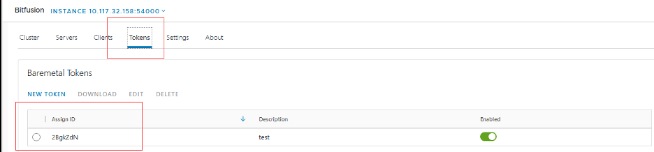
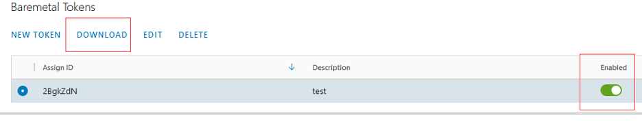

# 在Kubernets上使用Bitfusion构建AI应用
## AI任务和GPU加速 
人工智能（AI）技术可以赋予机器像人类一样运用智慧处理复杂任务的能力，是一门具有多种方法的跨学科科学，目前，机器学习和深度学习的发展正为科技行业的几乎每个领域带来着巨大的影响。

在深度学习中，训练深度网络模型（DNNs）时往往会遇到许多问题，其中最常见的就是训练时间过长。在训练深度网络时，有许多超参需要被仔细设定，如网络的层数，每一层包含的神经元个数，学习率，初始的网络权重等。同时，也有多种训练技巧应该被考虑，如使用batch采样（反向传播时为多个训练样本计算梯度值，而非每次只计算单个样本上的梯度），它可以加速模型训练过程。

从2010年开始，算法改进和机器算力的进步都为更复杂的深度神经网络模型的训练提供了更加高效的解决方案。多核心计算架构硬件拥有着强大的计算能力，如GPUs，它非常适合完成矩阵和向量的计算任务，因此可以极大加速网络的训练。截止2019年，具有 AI 特定增强功能的图形处理单元 (GPUs) 在AI领域中已取代 CPU，成为训练大规模商业云 AI 的主要计算单元。

Kubernets最初由Google公司设计和开发，于2014年6月更改为开源项目。自 2015 年 7 月 Google 和 Linux 合作成立 CNCF后，Kubernets开始由云原生计算基金会 (CNCF) 管理。Kubernets是一个排编系统，可以在生产中自动化管理数千个容器内的进程和处理。 它可以帮助解决如部署，扩展和管理等与容器化应用相关的基础而又冗杂的处理工作，已经成为了部署和管理机器学习任务流的重要应用平台。


## 目前GPU管理解决方案：
目前有3种常见的GPU资源使用方案：
- 一个任务流对应一个GPU
- 不同的工作流共享一个GPU资源，但任务彼此不独立
- 使用GPU虚拟化技术共享GPU资源

然而这几种GPU管理方案中可能存在一些潜在的缺陷，如：
- 没有充分利用GPU的计算周期
- 限制并预设了GPU资源粒度
- GPU资源受限于本机配置
- 难以实现应用调度


Bitfusion虚拟化通过提供网络接入式的GPU资源共享池有效地解决了这几个问题，使GPUs转变成了一层可被抽象，分区，自动化和共享的计算资源。然而，Kubernetes并没有提供直接使用Bitfusion虚拟化的GPU的接口，这一限制阻碍了工作负载在kubuernetes上使用Bitfusion虚拟GPU资源。为了更好地实现资源管理和GPU池管理，Kubernetes上需要一个可以使用Bitfusion虚拟GPU的解决方案。

## Bitfusion on Kubernetes

为了解决这一问题，Bitfusion on Kubernetes项目实现了在Kubernetes中应用Bitfusion虚拟化技术的方式。Bitfusion on Kubernetes支持通过透明的方式将GPU资源分配给开发人员，使用时利用Kubernetes的本地方法即可调用被Bitfusion虚拟化的GPU资源。Bitfusion on Kubernetes共包含三个组件：
- 用于在Kubernetes调用Bitfusion虚拟化GPU资源的device plugin
- 用于验证的validation webhook
- 用于处理的mutating webhook


准入控制器（admission controller）主要参与两个阶段，第一阶段运行突变准入控制器（mutating admission controllers），而第二阶段运行验证突变控制器（validating admission controllers）。在两个阶段中如果有任一一个控制器拒绝了请求，则整个请求就会被立即驳回并为用户反回错误信息。

准入控制器会调用与请求相匹配的validation webhooks，这是一个并行的处理，如果有一个拒绝了请求，则导致请求失败，这一准入控制器只运行在验证阶段。被调用的webhooks可能不会做出响应，否则会调用突变准入控制器。Bitfusion device plugin中的validation webhook是为了验证在Kubernetes集群中是否有可用的Bitfusion资源能够被分配。如果没有，在收到资源请求时系统会返回一条错误消息。
准入控制器会串行调用与请求相匹配mutating webhooks，如果需要的话webhook会改变这个请求对象。

Device plugin和webhooks（validation webhook，mutating webhook）在不同的两个docker镜像中构建。其中Kubernetes的device plugin在每个worker node中以DaemonSet服务的形式运行，同时此worker node中也运行着kubelet组件。Bitfusion的webhooks以Deployment服务的形式用在master node中运行。


潜在的用户：
- 打算在vSphere/Kubernetes上运行AI/ML任务和工作的用户
- 与VMware合作，负责提供AI应用解决方案的供应商
- 其他在Kubernetes上应用AI/ML的任务，倾向使用Bitfusion虚拟化GPU资源的个人或组织

## 如何使用“Bitfusion on Kubernetes”技术建立一个AI应用

计算机视觉是一个跨学科领域，旨在帮助计算机在图像和视频中获得高级的理解。计算机视觉技术是在人工智能领域和计算机领域中最具有研究前景的技术之一，在现代化时代发挥了巨大的优势并带来了庞大的商业价值。

计算机视觉的核心是设计一个可以捕捉，理解和解释图像或视频中重要视觉信息的的计算机系统，这个系统可以利用人类提供的上下文知识，将这些数据转化为用于驱动决策的洞察特征。计算机视觉的主要目标是能将原始的图像数据转化为高层次的理解，方便人类或计算机解释或者以其为基础处理其他的任务。

这一小结将介绍如何结合Bitfusion on Kubernetes技术，使用python中的TensoFlow机器学习库完成图像分类任务。

###  1.	准备环境
**(1)	Bitfusion**
在构建模型前，你需要准备和配置与相关DNN网络训练相关的环境。请确保你已经安装了VMware vSphere Bitfusion 和 NVIDIA 驱动。Bitfusion以client-server结构运行，会在VMware的应用程序中运行一个GPU服务器服务。此 GPU服务器必须可以访问本地的GPU资源（一般通过VMware vSphere DirectPath I/O进行访问），并安装了vSphere 7。Bitfusion客户端可以运行在安装了vSphere 7 或vSphere 6.7的虚拟机中。

Bitfusion 服务器将会在VMware vCenter中注册一个Bitfusion plug-in插件，这些插件用于监听和管理客户端与服务器。更多安装vSphere Bitfusion产品的细节可以参考: <https://docs.vmware.com/en/VMware-vSphere-Bitfusion/2.0/vmware-vsphere-bitfusion-20-installation-guide.pdf>

**(2)	Kubernetes**
为了在Kubernetes上启用Bitfusion，你需要部署一个Kubernetes集群或使用现有的Kubernetes环境去运行AI/ML工作程序。例如，您可以通过调用 Tanzu Kubernetes Grid Service 声明式 API 来配置 Tanzu Kubernetes 集群。更多关于Kubernetes Grid Service的细节请参考:  <https://docs.vmware.com/en/VMware-vSphere/7.0/vmware-vsphere-with-tanzu/GUID-3040E41B-8A54-4D23-8796-A123E7CAE3BA.html>


**(3)	Bitfusion device plugin**
随后你可以开始安装Bitfusion device plugin插件，他可以确保Kubernetes能与Bitfusion协同工作。为了启用Bitfusion，用户必须生成一个裸机令牌（Baremetal Token）来验证身份和下载安装过程中需要的tar文件包。

按照如下步骤从vCenter中获得token
第一步： 登录vCenter
第二步： 在Plugins中点击Bitfusion


第三步： 进入Tokens标签页面并选择下载合适的token


第四步： 点击DOWNLOAD按钮，确保此token已经被启用


如果token在列表中不可用，点击NEW TOKEN按钮来创建一个token。
更多请参考：<https://docs.vmware.com/en/VMware-vSphere-Bitfusion/2.5/Install-Guide/GUID-361A9C59-BB22-4BF0-9B05-8E80DE70BE5B.html>

随后使用这个token来创建一个Kubernetes密码。首先将token文件上传至虚拟机。使用如下命令来解压文件
```
$ mkdir tokens    
$ tar -xvf ./2BgkZdN.tar -C tokens
```

现在我们在tokens目录下有3个文件：ca.crt, client.yaml 和 services.conf :

```
tokens  
├── ca.crt  
├── client.yaml  
└── servers.conf  
```

随后使用如下命令在Kubernetes的kube-system命名空间中创建密码

```
$ kubectl create secret generic bitfusion-secret --from-file=tokens -n kube-system
```

更多关于kubectl的细节请参考<https://Kubernetes.io/docs/reference/kubectl/overview/>
随后，可以使用预编译好的镜像部署Bitfusion插件，首先使用以下命令来克隆源代码


```
$ git clone https://github.com/vmware/bitfusion-with-kubernetes-integration.git
```

随后使用以下命令来部署Bitfusion device plugin 设备插件和其他有关的组件，请确保Kubernetes集群可以接入网络

```
$ cd bitfusion-with-kubernetes-integration-main/bitfusion_device_plugin
$ make deploy
```
###  2. 应用需求和训练数据

此教程使用ImageNet数据集（ILSVRC2012），此数据集共包含 14,197,122张根据WordNet标注的有标签图像。其中的训练集是ImageNet 的一个子集，共包含 1000 个类别的 120 万张图像。ImageNet 中所有图像分辨率的平均值为 469x387。在图像预处理步骤中他们通常被裁剪为 256x256 或 224x224。该应用程序的目标是训练一个神经网络来对图像中的不同对象进行分类。在这篇博客中将使用 4 种类别的图像完成网络训练。

|  目录名称 | 类别 |  所含样本数量 | 标签|
| -----| -----  | ----  |----  |
|n01440764     | tench | 1300| 1 | 
|n01514668     | cock  | 1300|2 | 
|n02119022     | red fox | 1300|3 |
|n02489166     | proboscis monkey | 1300|0 | 

完整ILSVRC2012数据集请前往<http://www.image-net.org/download>下载

### 3.	根据需求建立AI模型
项目采用VGG19模型为基础构建了一个四分类的卷积神经网络（CNN）。VGG19是VGG模型家族中经典的一员，共包含19个神经层（16个卷积层和3个全连接层，5个最大池化层和一个Softmax回归层）。在VGG模型家族还包括VGG11，VGG16等模型，其中VGG19模型的浮点运算数（FLOPs）为197亿次。

简而言之，VGG是一个用于图像分类的深度卷积神经网络，VGG19的模型为：

>    Conv3x3 (64)
>    Conv3x3 (64)
>    MaxPool
>    Conv3x3 (128)
>    Conv3x3 (128)
>    MaxPool
>    Conv3x3 (256)
>    Conv3x3 (256)
>    Conv3x3 (256)
>    Conv3x3 (256)
>    MaxPool
>    Conv3x3 (512)
>    Conv3x3 (512)
>    Conv3x3 (512)
>    Conv3x3 (512)
>    MaxPool
>    Conv3x3 (512)
>    Conv3x3 (512)
>    Conv3x3 (512)
>    Conv3x3 (512)
>    MaxPool
>    Fully Connected (4096)
>    Fully Connected (4096)
>    Fully Connected (1000)
>    SoftMax


所有图像在输入网络前会调整至固定尺寸224x224，对应的矩阵的大小为(224,224,3)。在模型中，卷积使用 (3 * 3) 大小的卷积核，步长为1个像素，这使卷积操作能够覆盖图像所有区域，并采用same padding的方式，使得卷积后特征图的大小与输入一致来保持原有分辨率信息。随后最大池化层采用（2 * 2）的池化窗口，池化步长为2个像素。池化后紧跟ReLU非线性激活函数来帮助模型更好的完成分类任务。相比于其他如Sigmod，Tanh激活函数，ReLU被证明可以有效地缩短计算时间。

通过GPU加速，训练过程得到了很好的加速。下面是使用Tensorflow训练的代码脚本。

Train.py:

```
import os
import cv2
import numpy as np
import tensorflow as tf
from tensorflow.keras import layers, models
from tensorflow.keras.optimizers import Adam
from tensorflow.keras.utils import to_categorical
from tensorflow.keras.applications import VGG19

tf.compat.v1.disable_eager_execution()

# ID of GPU to be used for training
os.environ['CUDA_VISIBLE_DEVICES'] = '0'

# Directory of training samples
samples_dir = '/home/workspace/training/data/'

# HWC of the image to train
image_width = 224
image_height = 224
image_channels = 3

# Number of epochs for training
epochs = 100

# Batch size for training
batch_size = 64

# Percentage of samples to be used for training set
training_percent = 70

# Percentage of samples to be used for validation set
validation_percent = 15


def preprocess_images(data_to_process, labels_to_process):
    # Normalize the image to the range of (0, 0.1)
    data = data_to_process.astype("float32") / 255

    # Transform the label data to one-hot encoding. 4 categories for training.
    label = to_categorical(labels_to_process, 4)
    return data, label


def read_all_samples(sample_dir):
    # Number of total images
    num = 0

    # Category of the sample image
    number_of_class = 0

    # List to store the label of image
    label_list = []

    # List to store all the images
    img_list = []
    for directory in os.listdir(sample_dir):
        tmp_dir = os.path.join(sample_dir, directory)
        for image in os.listdir(tmp_dir):
            num += 1
            tmp_img_filepath = os.path.join(tmp_dir, image)

            # Read the image as the type of numpy.ndarray
            im = cv2.imread(tmp_img_filepath)

            # Corp the image
            im = cv2.resize(im, (image_width, image_height))
            img_list.append(im)

            # Add the category to List
            label_list.append(number_of_class)
            # print("Picture " + str(num) + " Load " + tmp_img_filepath + " successfully")
        number_of_class += 1

    print("All the " + str(num) + " pictures belong to " + str(number_of_class) + " categories")
    return np.array(img_list), np.array(label_list)


def split_data_set(data_to_process, label_to_process, training_set_percentage, validation_set_percentage):
    s = np.arange(data_to_process.shape[0])
    np.random.shuffle(s)
    # Images after shuffled
    data_to_process = data_to_process[s]

    # Labels after shuffled
    label_to_process = label_to_process[s]
    all_len = data_to_process.shape[0]

    # Number of samples for training set
    train_len = int(all_len * training_set_percentage / 100)

    # Number of samples for validation set
    validation_len = int(all_len * validation_set_percentage / 100)

    temp_len = train_len + validation_len

    # Training set and labels
    train_data, train_label = data_to_process[0:train_len, :, :, :], label_to_process[0:train_len, :]

    # Validation set and labels
    validation_data = data_to_process[train_len:temp_len, :, :, :]
    validation_label = label_to_process[train_len:temp_len, :]

    # Test set and labels
    test_data, test_label = all_data[temp_len:, :, :, :], all_label[temp_len:, :]

    return train_data, train_label, validation_data, validation_label, test_data, test_label


def train_classifier(train_data, train_label, valadation_data, valadation_label, lr=1e-4):
    conv_base = VGG19(weights='imagenet',  # Set weights = "imagenet" to use pre-trained parameters
                      include_top=False,
                      input_shape=(image_height, image_width, 3))
    model = models.Sequential()
    model.add(conv_base)
    model.add(layers.Flatten())
    model.add(layers.Dropout(0.5))
    model.add(layers.Dense(30, activation='relu'))
    model.add(layers.Dense(4, activation='softmax'))
    conv_base.trainable = True
    model.compile(
        loss='categorical_crossentropy',  # Loss fuction
        optimizer=Adam(lr=lr),  # Adam optimizer
        metrics=['accuracy'])

    # Prints a string summary of the network
    model.summary()

    early_stopping = tf.keras.callbacks.EarlyStopping(monitor="val_loss", min_delta=0, patience=5, verbose=0,
                                                      baseline=None, restore_best_weights=True)
    history = model.fit(
        train_data, train_label,
        batch_size=batch_size,  # iteration = epochs / batch_size,
        epochs=epochs,
        validation_data=(valadation_data, valadation_label),  # Data set for validation
        callbacks=[early_stopping])
    return model, history


all_data, all_label = read_all_samples(samples_dir)

# Sample data after being pre-processed
all_data, all_label = preprocess_images(all_data, all_label)

training_set, training_label, validation_set, validation_label, test_data, test_label = \
    split_data_set(all_data, all_label, training_percent, validation_percent)

# Train the model
train_classifier(training_set, training_label, validation_set, validation_label )

```

### 4.	使用Bitfusion on Kubernetes训练模型
**(1) 准备训练数据**
登录Kubernetes的worker node，在这里模型训练的工作负载将被执行。首先登录Kubernetes的一个worker node，在此节点上准备数据集和训练脚本。将ImageNet数据集(ILSVRC2012_img_train.tar)拷贝到节点的data目录下，并解压此tar文件。

```
$ scp ILSVRC2012_img_train.tar node1:/data
$ ssh node1
$ cd /data
$ mkdir /data/imageNet
$ tar xvf /data/ILSVRC2012_img_train.tar -C /data/imageNet
```
在运行上述代码后，会有1000个tar文件出现在data/imageNet目录下。每个tar文件中包含了同类别的图像样本。我们选择4个类别的tar文件作为项目的数据集(n01440764.tar,  n01514668.tar,  n02119022.tar,  n02489166.tar)。
```
/data/imageNet  
├── n01440764.tar  
├── n01514668.tar
├── n02119022.tar
└── n02489166.tar
```

使用如下命令会在工作空间中创建四个子目录，用于存放解压后的四个类别各自的图像样本，每个目录下包含1300个JPEG图像文件。
```
$ mkdir -p /home/workspace/training/data/0
$ mkdir -p /home/workspace/training/data/1
$ mkdir -p /home/workspace/training/data/2
$ mkdir -p /home/workspace/training/data/3
$ tar xvf /data/imageNet/n02489166.tar -C /home/workspace/training/data/0
$ tar xvf /data/imageNet/n01440764.tar -C /home/workspace/training/data/1
$ tar xvf /data/imageNet/n01514668.tar -C /home/workspace/training/data/2
$ tar xvf /data/imageNet/n02119022.tar -C /home/workspace/training/data/3
```

**(2) 配置用于训练任务的yaml文件**
在完成安装和准备工作后，用户可以编写一个yaml文件来指导Kubernetes利用Bitfusion的虚拟化资源。Yaml中共有三个与Bitfusion相关的配置参数。

- auto-management/Bitfusion: yes / no
使用auto-management/Bitfusion注解来描述是否为此工作负载启用Bitfusion device plugin
- Bitfusion.io/gpu-num:
- 从Bitfusion集群为此工作负载要分配的虚拟GPU数量
- Bitfusion.io/gpu-percent:
要分配的每块GPU的显存百分比

下面的Kubernetes 的yaml文件描述了训练工作负载的配置，其中train变量是存放训练集和训练脚本的目录，它将被挂载到Pod中。

运行 “tree /home/workspace/training” 命令后的控制台的输出信息
 
```
training
├── data
│   ├── 0
│   │   ├── n02489166_10029.JPEG
│   │   ├── n02489166_10031.JPEG
│   │    ……
│   ├── 1
│   │   ├── n01440764_10026.JPEG
│   │   ├── n01440764_10027.JPEG
│   │    ……
│   ├── 2
│   │   ├── n01514668_10004.JPEG
│   │   ├── n01514668_10014.JPEG
│   │    ……
│   ├── 3
│   │   ├── n02119022_10008.JPEG
│   │   ├── n02119022_10018.JPEG
│   │    ……
├── train.py
└── workload.yaml
```

workload.yaml文件中的内容：
```
apiVersion: v1
kind: Pod
metadata:
  annotations:
    auto-management/bitfusion: "all"
    bitfusion-client/os: "ubuntu18"
    bitfusion-client/version: "400"
  name: newtrain
  namespace: bwki
spec:
  containers:
    - image: bitfusiondeviceplugin/tensorflow:20.01-tf2-py3
      imagePullPolicy: IfNotPresent
      name: newtrain
      command: ["python /home/workspace/training/train.py"]
      resources:
        limits:
          bitfusion.io/gpu-amount: 1
          bitfusion.io/gpu-percent: 100
      volumeMounts:
        - name: code
          mountPath: /home/workspace/training/
  volumes:
    - name: code
      hostPath:
        path: /home/workspace/training/
```

Bitfusiondeviceplugin/tensorflow:20.01-tf2-py3 是一个基于NGC 的docker容器镜像(nvcr.io/nvidia/tensorflow:20.01-tf2-py3)。此容器中环境的详细信息为：

Here is the information of the container:
>Ubuntu 18.04.3 LTS
>Python version 3.6.9
>Tensorflow version GPU 2.0.0  
>Cuda version 10.2.89
>opencv version 4.5.1

其中openCV模块被安装在了镜像中。openCV模块是在训练前用于预处理图像的模块。对于其他镜像，可以登录容器并使用如下命令安装openCV模块，训练工作负载会使用处理后的图像进行训练。

```
$ pip install opencv-python
$ apt-get update
$ apt-get install -y libgl1-mesa-dev
```

### **(3) 提交并监控训练任**
使用kubectl命令像Kubernetes集群提交训练任务 
```
$ kubectl create -f /home/workspace/training/workload.yaml
```


使用下面的命令可以查看训练模型的日志信息：
```
$ kubectl logs -f -n bwki  newtrain
```
日志输出为：
```
[INFO] 2021-09-03T00:39:22Z Query server 10.117.32.177:56001 to claim client id: 83a890bb-422d-419f-a5d8-61db0d149cf1
[WARN] 2021-09-03T00:39:23Z Unable to backup old client config file: rename /root/.bitfusion/client.yaml /root/.bitfusion/client.yaml.20210903T003923: device or resource busy
[INFO] 2021-09-03T00:39:23Z Query server 10.117.32.177:56001 gpu availability
[INFO] 2021-09-03T00:39:23Z Choosing GPUs from server list [10.117.32.177:56001]
[INFO] 2021-09-03T00:39:23Z Requesting GPUs [0] with 16160 MiB of memory from server 0, with version 4.0.0-639f4163...
Requested resources:
Server List: 10.117.32.177:56001
Client idle timeout: 0 min
[INFO] 2021-09-03T00:39:23Z Locked 1 GPUs with partial memory 1, configuration saved to '/tmp/bitfusion940406361'
[INFO] 2021-09-03T00:39:23Z Running client command 'python /home/workspace/training/train.py' on 1 GPUs, with the following servers:
[INFO] 2021-09-03T00:39:23Z 10.117.32.177 55001 02491a45-fb7d-4894-833f-bf71ea724e44 56001 4.0.0-639f4163

[INFO] 2021-09-03T00:39:23Z Command started, launching telemetry process: 83a890bb-422d-419f-a5d8-61db0d149cf1 | 10.117.32.177:56001
2021-09-03 00:39:24.627043: I tensorflow/stream_executor/platform/default/dso_loader.cc:44] Successfully opened dynamic library libcudart.so.10.2
WARNING:tensorflow:From /usr/local/lib/python3.6/dist-packages/tensorflow_core/python/ops/resource_variable_ops.py:1630: calling BaseResourceVariable.__init__ (from tensorflow.python.ops.resource_variable_ops) with constraint is deprecated and will be removed in a future version.
Instructions for updating:
If using Keras pass *_constraint arguments to layers.
All the 5200 pictures belong to 4 categories
Downloading data from https://github.com/fchollet/deep-learning-models/releases/download/v0.1/vgg19_weights_tf_dim_ordering_tf_kernels_notop.h5
80142336/80134624 [==============================] - 6s 0us/step
2021-09-03 00:40:08.687324: I tensorflow/stream_executor/platform/default/dso_loader.cc:44] Successfully opened dynamic library libcuda.so.1
2021-09-03 00:40:09.428650: I tensorflow/stream_executor/cuda/cuda_gpu_executor.cc:1006] successful NUMA node read from SysFS had negative value (-1), but there must be at least one NUMA node, so returning NUMA node zero
2021-09-03 00:40:09.430776: I tensorflow/core/common_runtime/gpu/gpu_device.cc:1618] Found device 0 with properties: 
name: Tesla V100-PCIE-16GB major: 7 minor: 0 memoryClockRate(GHz): 1.38
pciBusID: 0000:00:00.0
2021-09-03 00:40:09.431164: I tensorflow/stream_executor/platform/default/dso_loader.cc:44] Successfully opened dynamic library libcudart.so.10.2
2021-09-03 00:40:09.436589: I tensorflow/stream_executor/platform/default/dso_loader.cc:44] Successfully opened dynamic library libcublas.so.10
2021-09-03 00:40:09.440560: I tensorflow/stream_executor/platform/default/dso_loader.cc:44] Successfully opened dynamic library libcufft.so.10
2021-09-03 00:40:09.441540: I tensorflow/stream_executor/platform/default/dso_loader.cc:44] Successfully opened dynamic library libcurand.so.10
2021-09-03 00:40:09.444674: I tensorflow/stream_executor/platform/default/dso_loader.cc:44] Successfully opened dynamic library libcusolver.so.10
2021-09-03 00:40:09.445680: I tensorflow/stream_executor/platform/default/dso_loader.cc:44] Successfully opened dynamic library libcusparse.so.10
2021-09-03 00:40:09.450682: I tensorflow/stream_executor/platform/default/dso_loader.cc:44] Successfully opened dynamic library libcudnn.so.7
2021-09-03 00:40:09.451312: I tensorflow/stream_executor/cuda/cuda_gpu_executor.cc:1006] successful NUMA node read from SysFS had negative value (-1), but there must be at least one NUMA node, so returning NUMA node zero
2021-09-03 00:40:09.454656: I tensorflow/stream_executor/cuda/cuda_gpu_executor.cc:1006] successful NUMA node read from SysFS had negative value (-1), but there must be at least one NUMA node, so returning NUMA node zero
2021-09-03 00:40:09.455954: I tensorflow/core/common_runtime/gpu/gpu_device.cc:1746] Adding visible gpu devices: 0
2021-09-03 00:40:09.465116: I tensorflow/core/platform/profile_utils/cpu_utils.cc:94] CPU Frequency: 2194840000 Hz
2021-09-03 00:40:09.466026: I tensorflow/compiler/xla/service/service.cc:168] XLA service 0x7b24240 executing computations on platform Host. Devices:
2021-09-03 00:40:09.466046: I tensorflow/compiler/xla/service/service.cc:175]   StreamExecutor device (0): Host, Default Version
2021-09-03 00:40:09.893734: I tensorflow/stream_executor/cuda/cuda_gpu_executor.cc:1006] successful NUMA node read from SysFS had negative value (-1), but there must be at least one NUMA node, so returning NUMA node zero
2021-09-03 00:40:09.895593: I tensorflow/compiler/xla/service/service.cc:168] XLA service 0x7bb6dc0 executing computations on platform CUDA. Devices:
2021-09-03 00:40:09.895622: I tensorflow/compiler/xla/service/service.cc:175]   StreamExecutor device (0): Tesla V100-PCIE-16GB, Compute Capability 7.0
2021-09-03 00:40:09.899735: I tensorflow/stream_executor/cuda/cuda_gpu_executor.cc:1006] successful NUMA node read from SysFS had negative value (-1), but there must be at least one NUMA node, so returning NUMA node zero
2021-09-03 00:40:09.903433: I tensorflow/core/common_runtime/gpu/gpu_device.cc:1618] Found device 0 with properties: 
name: Tesla V100-PCIE-16GB major: 7 minor: 0 memoryClockRate(GHz): 1.38
pciBusID: 0000:00:00.0
2021-09-03 00:40:09.903560: I tensorflow/stream_executor/platform/default/dso_loader.cc:44] Successfully opened dynamic library libcudart.so.10.2
2021-09-03 00:40:09.903608: I tensorflow/stream_executor/platform/default/dso_loader.cc:44] Successfully opened dynamic library libcublas.so.10
2021-09-03 00:40:09.903665: I tensorflow/stream_executor/platform/default/dso_loader.cc:44] Successfully opened dynamic library libcufft.so.10
2021-09-03 00:40:09.903724: I tensorflow/stream_executor/platform/default/dso_loader.cc:44] Successfully opened dynamic library libcurand.so.10
2021-09-03 00:40:09.903764: I tensorflow/stream_executor/platform/default/dso_loader.cc:44] Successfully opened dynamic library libcusolver.so.10
2021-09-03 00:40:09.903856: I tensorflow/stream_executor/platform/default/dso_loader.cc:44] Successfully opened dynamic library libcusparse.so.10
2021-09-03 00:40:09.903905: I tensorflow/stream_executor/platform/default/dso_loader.cc:44] Successfully opened dynamic library libcudnn.so.7
2021-09-03 00:40:09.904382: I tensorflow/stream_executor/cuda/cuda_gpu_executor.cc:1006] successful NUMA node read from SysFS had negative value (-1), but there must be at least one NUMA node, so returning NUMA node zero
2021-09-03 00:40:09.907768: I tensorflow/stream_executor/cuda/cuda_gpu_executor.cc:1006] successful NUMA node read from SysFS had negative value (-1), but there must be at least one NUMA node, so returning NUMA node zero
2021-09-03 00:40:09.909568: I tensorflow/core/common_runtime/gpu/gpu_device.cc:1746] Adding visible gpu devices: 0
2021-09-03 00:40:09.909699: I tensorflow/stream_executor/platform/default/dso_loader.cc:44] Successfully opened dynamic library libcudart.so.10.2
2021-09-03 00:40:10.831725: I tensorflow/core/common_runtime/gpu/gpu_device.cc:1159] Device interconnect StreamExecutor with strength 1 edge matrix:
2021-09-03 00:40:10.831853: I tensorflow/core/common_runtime/gpu/gpu_device.cc:1165]      0 
2021-09-03 00:40:10.831880: I tensorflow/core/common_runtime/gpu/gpu_device.cc:1178] 0:   N 
2021-09-03 00:40:10.838896: I tensorflow/stream_executor/cuda/cuda_gpu_executor.cc:1006] successful NUMA node read from SysFS had negative value (-1), but there must be at least one NUMA node, so returning NUMA node zero
2021-09-03 00:40:10.841527: I tensorflow/stream_executor/cuda/cuda_gpu_executor.cc:1006] successful NUMA node read from SysFS had negative value (-1), but there must be at least one NUMA node, so returning NUMA node zero
2021-09-03 00:40:10.843254: I tensorflow/core/common_runtime/gpu/gpu_device.cc:1304] Created TensorFlow device (/job:localhost/replica:0/task:0/device:GPU:0 with 14523 MB memory) -> physical GPU (device: 0, name: Tesla V100-PCIE-16GB, pci bus id: 0000:00:00.0, compute capability: 7.0)
2021-09-03 00:40:13.987431: I tensorflow/stream_executor/platform/default/dso_loader.cc:44] Successfully opened dynamic library libcublas.so.10
2021-09-03 00:40:14.442519: I tensorflow/stream_executor/platform/default/dso_loader.cc:44] Successfully opened dynamic library libcudnn.so.7
Model: "sequential"
_________________________________________________________________
Layer (type)                 Output Shape              Param #   
=================================================================
vgg19 (Model)                (None, 7, 7, 512)         20024384  
_________________________________________________________________
flatten (Flatten)            (None, 25088)             0         
_________________________________________________________________
dropout (Dropout)            (None, 25088)             0         
_________________________________________________________________
dense (Dense)                (None, 30)                752670    
_________________________________________________________________
dense_1 (Dense)              (None, 4)                 124       
=================================================================
Total params: 20,777,178
Trainable params: 20,777,178
Non-trainable params: 0
_________________________________________________________________
Train on 3640 samples, validate on 780 samples
Epoch 1/100
3640/3640 [==============================] - 74s 20ms/sample - loss: 1.3575 - accuracy: 0.3299 - val_loss: 1.2894 - val_accuracy: 0.3551
Epoch 2/100
3640/3640 [==============================] - 26s 7ms/sample - loss: 1.2549 - accuracy: 0.4151 - val_loss: 1.1419 - val_accuracy: 0.5090
Epoch 3/100
3640/3640 [==============================] - 25s 7ms/sample - loss: 0.9351 - accuracy: 0.6363 - val_loss: 0.6234 - val_accuracy: 0.7628
Epoch 4/100
3640/3640 [==============================] - 25s 7ms/sample - loss: 0.5321 - accuracy: 0.8093 - val_loss: 0.3510 - val_accuracy: 0.8615
Epoch 5/100
3640/3640 [==============================] - 25s 7ms/sample - loss: 0.3628 - accuracy: 0.8635 - val_loss: 0.3108 - val_accuracy: 0.8821
Epoch 6/100
3640/3640 [==============================] - 25s 7ms/sample - loss: 0.2457 - accuracy: 0.9137 - val_loss: 0.4020 - val_accuracy: 0.8564
Epoch 7/100
3640/3640 [==============================] - 25s 7ms/sample - loss: 0.1823 - accuracy: 0.9374 - val_loss: 0.1050 - val_accuracy: 0.9628
Epoch 8/100
3640/3640 [==============================] - 25s 7ms/sample - loss: 0.1309 - accuracy: 0.9527 - val_loss: 0.0829 - val_accuracy: 0.9731
Epoch 9/100
3640/3640 [==============================] - 25s 7ms/sample - loss: 0.1105 - accuracy: 0.9618 - val_loss: 0.1686 - val_accuracy: 0.9410
Epoch 10/100
3640/3640 [==============================] - 25s 7ms/sample - loss: 0.0898 - accuracy: 0.9703 - val_loss: 0.2330 - val_accuracy: 0.9256
Epoch 11/100
3640/3640 [==============================] - 25s 7ms/sample - loss: 0.0888 - accuracy: 0.9703 - val_loss: 0.1214 - val_accuracy: 0.9628
Epoch 12/100
3640/3640 [==============================] - 25s 7ms/sample - loss: 0.0982 - accuracy: 0.9736 - val_loss: 0.1666 - val_accuracy: 0.9487
Epoch 13/100
3640/3640 [==============================] - 25s 7ms/sample - loss: 0.0774 - accuracy: 0.9761 - val_loss: 0.0745 - val_accuracy: 0.9731
Epoch 14/100
3640/3640 [==============================] - 25s 7ms/sample - loss: 0.0330 - accuracy: 0.9901 - val_loss: 0.0668 - val_accuracy: 0.9833
Epoch 15/100
3640/3640 [==============================] - 25s 7ms/sample - loss: 0.0205 - accuracy: 0.9934 - val_loss: 0.1073 - val_accuracy: 0.9679
Epoch 16/100
3640/3640 [==============================] - 25s 7ms/sample - loss: 0.0558 - accuracy: 0.9810 - val_loss: 0.1615 - val_accuracy: 0.9538
Epoch 17/100
3640/3640 [==============================] - 25s 7ms/sample - loss: 0.0401 - accuracy: 0.9874 - val_loss: 0.0903 - val_accuracy: 0.9718
Epoch 18/100
3640/3640 [==============================] - 25s 7ms/sample - loss: 0.0212 - accuracy: 0.9940 - val_loss: 0.1802 - val_accuracy: 0.9564
Epoch 19/100
3640/3640 [==============================] - 25s 7ms/sample - loss: 0.0338 - accuracy: 0.9901 - val_loss: 0.1458 - val_accuracy: 0.9679
[INFO] 2021-09-03T00:49:01Z Releasing GPUs from config file '/tmp/bitfusion940406361'...
[INFO] 2021-09-03T00:49:01Z Released GPUs on 1 servers and removed generated config file '/tmp/bitfusion940406361'
```

###  5.	评估模型
在每个epoch训练结束后，控制台会输出此epoch中的训练损失（train loss），训练精度(train accuracy)，验证损失(validation loss)和验证精度(validation accuracy)。其中验证精度描述了模型在验证集上的表现。根据这一数据，用户可以暂停训练并对模型进行微调和改进。
